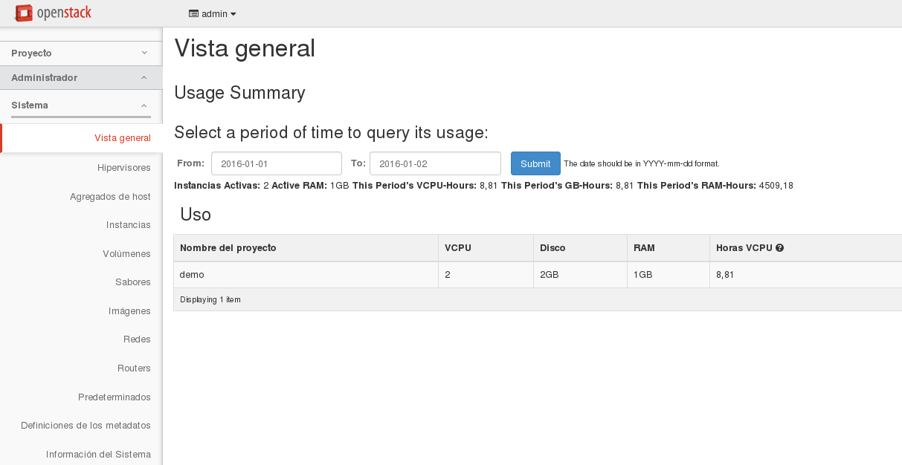
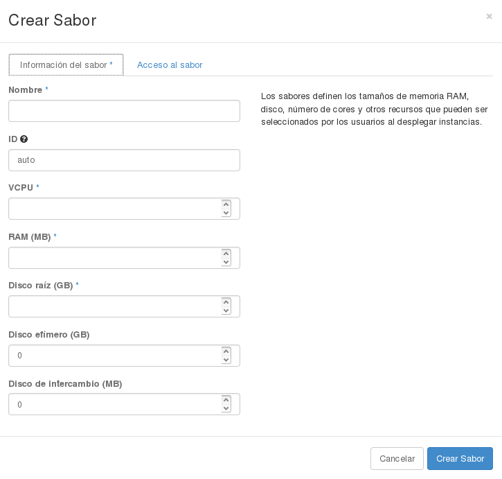
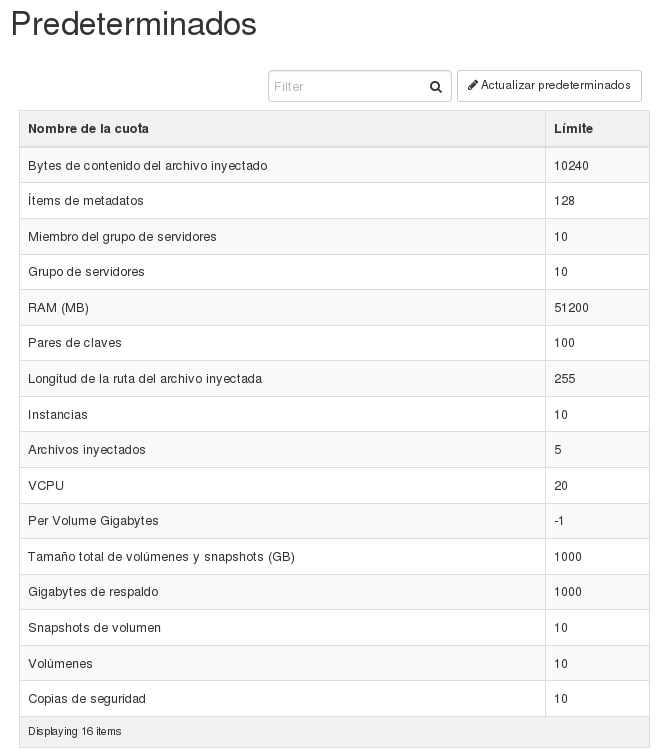
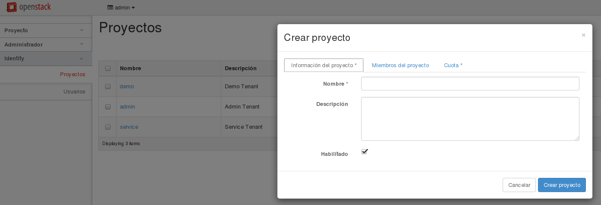
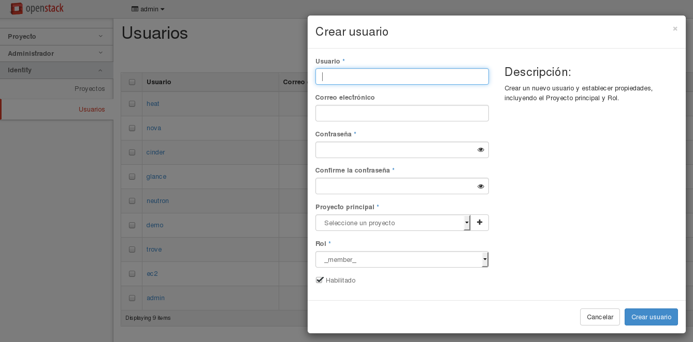

##Administración básica con horizon

Si accedemos como usuario administrador al dashboard horizon tenemos a nuestra disposición una serie de funciones que nos permiten una administración básica de nuestro OpenStack.

###Apartado "Sistema"

Veamos las distintas opciones que podemos encontrar en la sección **Sistema**:

* **Vista general**: Obtenemos una estadística general clasificada por proyectos.
* **Hipervisores**: Información sobre los hipervisores que estamos utilizando para la virtualización de las máquinas.
* **Agregados de host**: La agregación de hosts divide una zona de disponibilidad en unidades mediante la agrupación de los hosts. En esta pestaña podemos crear nuevos agregados de host y obtener información sobre las zonas de disponibilidad.
* **Instancias**: Se accede a la gestión de todas las instancias de todos los proyectos.
* **Volúmenes**: Se accede a la gestión de todos los volúmenes de todos los proyectos.
* **Sabores**: Podemos gestionar los sabores (flavors) definidos. Podemos crear nuevos sabores:
    
    

    Como podemos ver en la imagen tenemos que definir las características del nuevo sabor a crear. Además con la opción **Acceso al sabor** podemos definir desde los proyectos que se va a tener acceso al sabor que estamos definiendo.

* **Imágenes**: Nos permite gestionar las imágenes a las que tienen acceso los usuarios.
* **Redes**: Podemos gestionar todas las redes internas de todos los proyectos. Además tenemos acceso a la red externa que hemos definido, pudiendo modificarla si es necesario.
* **Routers**: Nos permite gestionar los distintos routers que se han creado en los proyectos.
* **Predeterminados**: Desde esta opción podemos ver y modificar las cuotas predeterminadas (límites máximos). Posteriormente veremos que para cada proyecto se pueden modificar las cuotas.

    

* **Definición de los metadatos**: Nos permite importar namespace y ver información sobre los metadatos.
* **Información del Sistema**: Puedes acceder a la siguiente información:
    * Servicios: Ver la lista de servicios.
    * Servicios de computación: Ver los servicios de computación instalados.
    * Servicios de almacenamiento de datos: Ver los servicios de almacenamiento de datos.
    * Agentes de red: Ver los distintos servicios de red instalados.

###Apartado "Identity"

En este apartado podemos gestionar los usuarios y proyectos definidos en el sistema.

* **Proyectos**: Nos permite gestionar los proyectos definidos en el sistema. Podemos crear nuevos proyectos, administrar los usuarios que forman parte del proyecto, especificar las cuotas que van a afectar a un proyecto determinado.

    

* **Usuarios**: Desde esta opción gestionamos los usuarios del sistema, podemos editarlos y crear usuarios nuevos.

    

