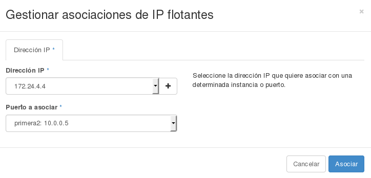

##Crear una instancia a partir de una imagen

El objetivo de esta sección es mostrar es la creación de una instancia GNU/Linux
a partir de una de las imágenes disponibles. Para ello accedemos al apartado
**Instancias** > **Lanzar instancia** y a continuación tenemos
que indicar los siguientes datos:

* El primer panel es utilizado para indicar el tipo de instancia y la imagen que
se aplicarán al servidor. Los valores a introducir son:
  * Nombre : El nombre que pondremos al servidor virtual o instancia.
  * Sabor: Se debe elegir el nombre del tipo de instancia o sabor a
  aplicar en la creación, las características del sabor elegido se muestran en 
  el panel lateral.
  * Recuento de instancias: Número de instancias que vamos a crear.
  * Origen de arranque de la instancia: Indica si vamos a crear el servidor a partir de una
  imagen, una instantánea o un volumen. En
  este caso será a partir de una imagen, veremos el resto de casos más
  adelante.
  * Nombre de la imagen: Indicamos la imagen virtual, la instantánea o el volumen concreto
  que queremos utilizar para instalar el sistema operativo de nuestra instancia.
  

* En el segundo panel se gestionan temas de seguridad. Los datos a indicar son:
  * Par de claves: Se selecciona una clave pública de una lista de claves
  públicas creadas previamente en el apartado **Acceso y Seguridad**. 
  * Se selecciona uno o más grupos de seguridad para aplicar en la instancia a la
  hora de gestionar el tráfico en la red.

* En el tercer panel se indican las redes a las cuales queremos que pertenezca
nuestro servidor, es decir donde nuestro servidor virtual tendrá una IP fija.

* De forma general no es necesario indicar nada en los dos paneles adicionales
"Pos-creación" y "Opciones avanzadas" por lo que ya es posible pulsar el botón
"Lanzar" y al cabo de unos segundos podemos ver que nuestra instancia ha
sido creada, que tiene asignada una IP fija:

* Por último, para poder acceder a la instancia desde el exterior tenemos que
asignar a la instancia una IP flotante, para ello:
  * Elegimos la opción **IP flotantes** en el apartado **Acceso y Seguridad** y reservamos una nueva IP, con la opción **Asignar IP al proyecto**. 

  

  * A continuación podemos elegir la opción **Asociar** de la IP flotante que hemos reservado, y asignamos esa nueva IP a la instancia que acabamos de crear.

  

* Recuerda que una vez que la IP pública no esté asignada a una instancia se
puede liberar.
* El último paso es simplemente acceder a la instancia utilizando la clave 
privada correspondiente a la clave pública que se ha inyectado en la
instancia:

    $ ssh -i clave_demo.pem debian@172.22.204.143
    The authenticity of host '172.22.204.143 (172.22.204.143)' can't be established.
    ECDSA key fingerprint is 0d:65:b9:fc:33:1d:68:32:71:47:8a:fb:8a:ba:39:63.
    Are you sure you want to continue connecting (yes/no)? yes
    Warning: Permanently added '172.22.204.143' (ECDSA) to the list of known hosts.

    The programs included with the Debian GNU/Linux system are free software;
    the exact distribution terms for each program are described in the
    individual files in /usr/share/doc/*/copyright.

    Debian GNU/Linux comes with ABSOLUTELY NO WARRANTY, to the extent
    permitted by applicable law.
    debian@primera:~$ 

