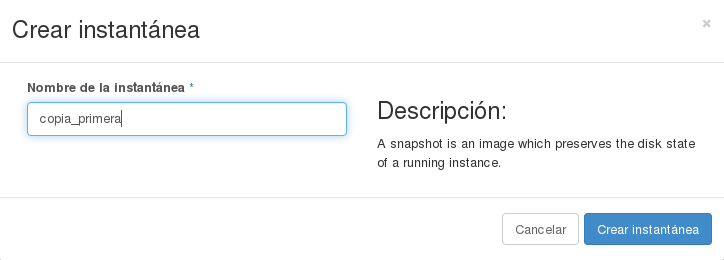
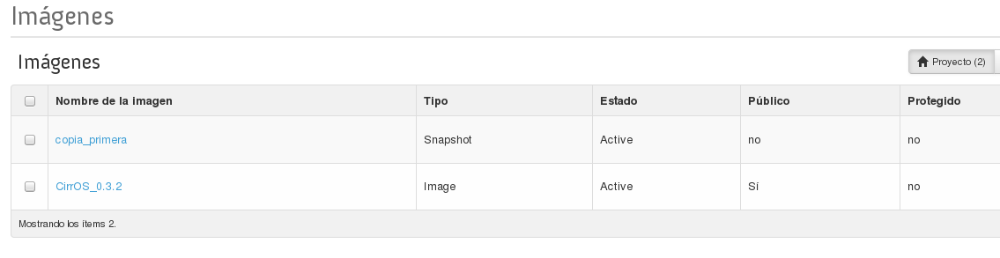
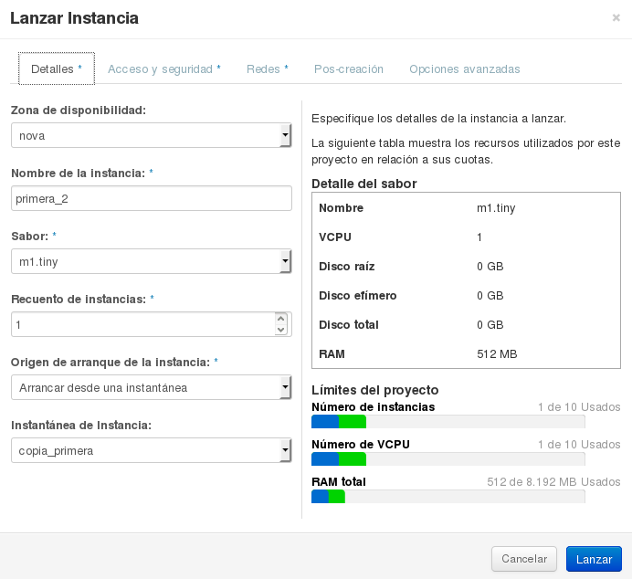

## Instantáneas (*snapshots*)

En cualquier momento se puede crear una instantánea de una instancia,
con lo que se creará una nueva imagen con el estado actual de la
instancia. Es una funcionalidad muy interesante, ya que al almacenarse
como una nueva imagen, es posible realizar posteriormente el número de
nuevas instancias que se deseen, este proceso es diferente cuando se
utilizan volúmenes para almacenar el sistema raíz de una instancia,
como se verá en el siguiente tema.

Veamos cómo se hace partiendo de una instancia Debian que se está
ejecutando.

Vamos a acceder a la instancia y vamos a realizar un cambio sobre
ella, lo mas sencillo es crear un fichero de texto.

		$ ssh -i clave_demo.pem debian@172.22.204.143			
		The programs included with the Debian GNU/Linux system are free software;
		the exact distribution terms for each program are described in the
		individual files in /usr/share/doc/*/copyright.			
		Debian GNU/Linux comes with ABSOLUTELY NO WARRANTY, to the extent
		permitted by applicable law.
		Last login: Fri Dec 25 21:20:54 2015 from 172.19.0.26
		debian@primera:~$ touch nuevo_fichero.txt
		debian@primera:~$

A continuación vamos a realizar una instantánea de la instancia,
con lo que se nos creará una nueva imagen desde la que podremos crear
nuevas instancias. Creamos la instantánea escogiendo la opción de **Crear instantánea**:

Y podemos observar que en la lista de **Imágenes** encontramos una nueva
  imagen de tipo *snapshot*:

A continuación podemos crear una nueva instancia a a partir de esta
  instantánea: 

Y por último podemos acceder a la nueva instancia (a la que le
hemos asignado una nueva IP pública y a la que hemos asociado la
clave SSH mi_clave.pem), y comprobar que tiene el fichero que
creamos en la instancia anterior: 

		$ ssh -i clave_demo.pem debian@172.22.204.144			
		The programs included with the Debian GNU/Linux system are free software;
		the exact distribution terms for each program are described in the
		individual files in /usr/share/doc/*/copyright.			
		Debian GNU/Linux comes with ABSOLUTELY NO WARRANTY, to the extent
		permitted by applicable law.
		Last login: Fri Dec 26 21:20:54 2015 from 172.19.0.26
		debian@primera_2:~$ ls
		nuevo_fichero.txt
		debian@primera_2:~$ 

