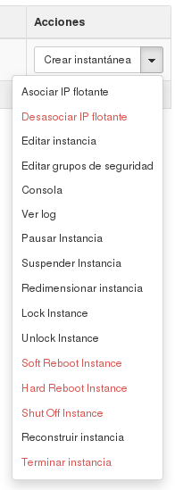

## Operaciones sobre instancias

### Acciones del ciclo de vida de las instancias

Una de las cosas que llama la atención cuando se empieza a utilizar IaaS es que
se hable del ciclo de vida de un servidor, ya que en infraestructura clásica
(tanto de máquinas físicas como virtuales) no existe este concepto, ya que en
infraestructura clásica se espera que un servidor se encienda, se configure y no
se apague salvo en casos excepcionales. La diferencia fundamental con la
infraestructura en nube es que en este caso, se pude tener infraestructura
dinámica compuesta por un número variables de servidores con características
adecuadas para la demanda que haya en cada momento, por eso es importante
controlar de que forma se puede parar, reiniciar o incluso destruir una
instancia.

Las diferentes acciones que se pueden realizar sobre una instancia una vez
creada son las siguientes:

* **Pausar instancia**: Paramos la ejecución de una instancia, guardando su
  estado en memoria RAM.
* **Suspender instancia**: Paramos la ejecución de una instancia, guardando
  su estado en disco.
* **Apagagao instancia**: Apagamos la máquina virtual, pero sigue definida,
  por lo que puede volver a arrancarse con las mismas características cuando sea
  necesario.
* **Encender instancia**: Si tenemos una instancia apagada, nos permite
  encenderla.
* **Reanudar instancia**: Si tenemos una instancia suspendida o pausada, nos
  permite indicar que la máquina siga funcionando. 
* **Reiniciar instancia**: Ejecuta un comando *reboot* en la instancia. Tenemos dos tipos: "suave" que intenta hacer un apagado normal de la máquina y su reinicio; también podemos hacer un reinicio "duro", si tenemos algún problema en la instancia.
* **Terminar instancia**: Destruye la instancia, liberando los recursos que
  tenía ocupados.

### Acciones de la configuración de red de la instancia

* **Asociar IP flotante**: Nos permite asociar a la instancia una de la sIP flotantes que tengamos reservadas.

### Acciones sobre la configuración de la seguridad de la instancia

* **Editar Grupos de Seguridad**: Nos permite añadir o
  quitar grupos de seguridad aplicados a la instancia.

### Acciones avanzadas sobre la instancias:

* **Redimensionar instancia**: Podemos cambiar el sabor de la instancias.
* **Reconstruir instancia**: Mecanismo que nos posibilita acceder al disco de una instancia que tenga algún problema, con el objetivo se solucionar dicho problema.

### Acceso a la información de las instancias

* **Editar instancia**: Nos permite cambiar el nombre de la instancia.
* **Ver log**: Podemos acceder al log de arranque de la instancia. 
* **Consola**: Por último, podemos acceder a una **consola VNC** para manejar nuestra
  instancia como si se tratase de una máquina virtual, aunque deberá estar
  definida previamente la contraseña del usuario.
