##Pasos previos

## Pares de claves ssh

Puesto que estamos en un entorno de recursos compartidos y es bastante habitual
que la misma imagen pueda ser instanciada por distintos usuarios, no es
razonable que la imagen tenga una contraseña de acceso común, que permitiría a
cualquiera poder acceder a la instancia de otro usuario en el momento que se
crease, por lo que la solución más común en IaaS es utilizar pares de claves
pública/privada para configurar de forma segura el acceso por ssh a las
instancias.

El usuario debe almacenar la o las claves públicas que vaya a utilizar en la
nube de infraestructura y cuando se crea una instancia se selecciona la clave
pública que se desea utilizar para acceder a la misma, durante el proceso de
instanciación, el sistema "inyecta" la clave pública en el usuario
correspondiente del sistema, de manera que sólo el poseedor de la
correspondiente clave privada podrá acceder al mismo. 

Podemos optar por subir al sistema una clave pública que tengamos previamente o
bien solicitar al sistema que cree un par de claves pública/privada. Es
obviamente mucho más segura y recomendable la primera opción, ya que nadie
gestiona ni tiene acceso en ningún caso a una clave privada, pero la segunda
opción es muy sencilla y puede ser aceptable para pruebas o entornos donde la
seguridad no es un aspecto fundamental como en el caso que nos ocupa en el 
que simplemente queremos aprender a utilizar este entorno.

Para crear nuestro par de claves vamos a la sección **Acceso y Seguridad** -> **Pares de Claves** -> **Crear par de claves**:

Al crearse el par de claves, el sistema almacena la clave pública del usuario y
envía al usuario la clave privada.
	

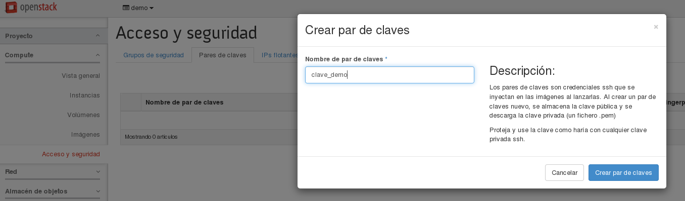

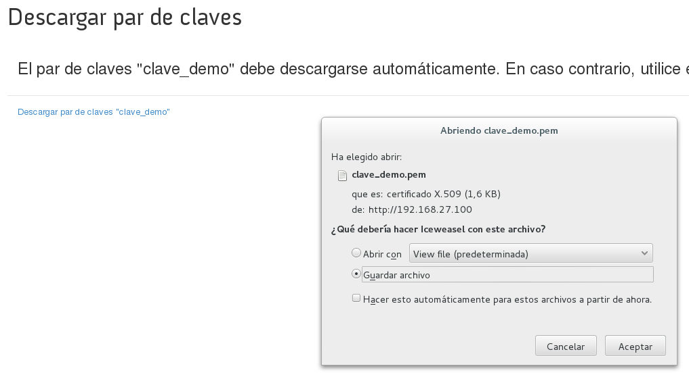

Nos descargamos la clave privada, almacenándola localmente (normalmente en el
directorio ~/.ssh) y le asignamos los permisos adecuados para que ningún otro
usuario pueda leerla (son válidos los modos 0400 o 0600):

<pre>
$ mv Descargas/clave_demo.pem ~/.ssh
$ chmod 0600 ~/.ssh/clave_demo.pem
</pre>

## Grupos de Seguridad o Cortafuegos de la instancia

Toda instancia que se crea en OpenStack tiene asociado uno o varios grupos de
seguridad, que consisten en un conjunto de reglas de iptables que actúan como un
cortafuegos. Es importante destacar que este cortafuegos se aplica a nivel de la
interfaz de red, no se trata por tanto de un cortafuegos perimetral y por tanto
las reglas también afectan a las instancias que estén en el mismo segmento de red.

La configuración por defecto más habitual en todos los entornos de OpenStack es
que la instancia tiene abierto todo el tráfico de salida, pero cerrado todo el
tráfico de entrada. A esta configuración inicial es necesario añadirle la
apertura al tráfico entrante de todos los servicios que queramos que estén
accesibles desde el exterior, en particular aquellos que nos permitan acceder a
ella para su gestión.

### Creación de un grupo de seguridad

Para acceder al cortafuegos, elegimos la pantalla **Acceso y Seguridad**
y la opción **Grupos de Seguridad**. Creamos un nuevo grupo de seguridad al que llamamos
"ssh_y_ping":

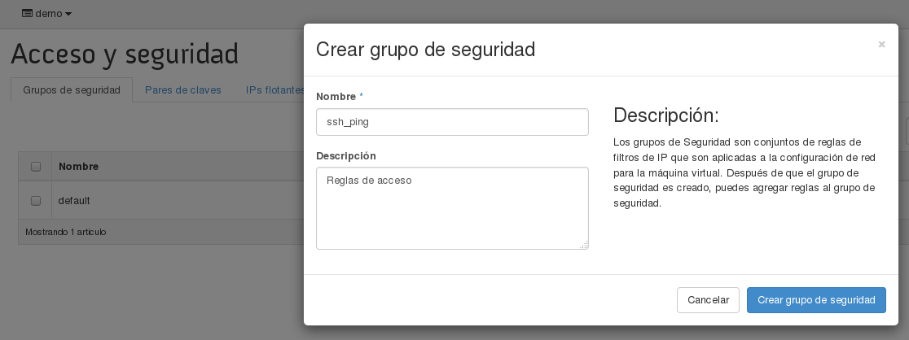

Seleccionamos el nuevo grupo de seguridad creado y elegimos **Administrar reglas**. Para permitir el tráfico ssh, abrimos el tráfico tcp desde el puerto 22
al puerto 22:

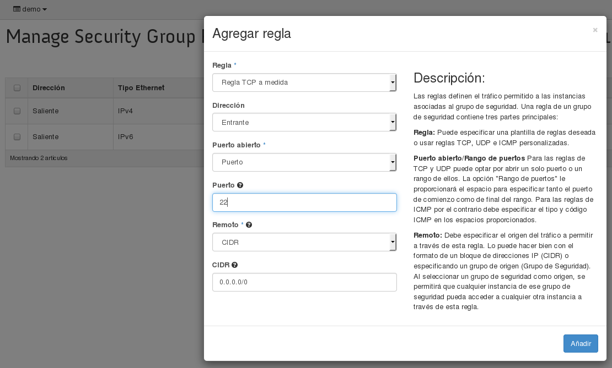

Procedemos de igual forma para permitir todo el tráfico ICMP.

## Configuración inicial de red

Si comprobamos el esquema por defecto que tenemos en nuestro proyecto podemos observar que sólo tenemos definido la red externa (ext-net) que es común para todos los proyectos. Si accedemos a la opción **Topología de Red** dentro del apartado de **Red**, podemos ver el siguiente esquema:

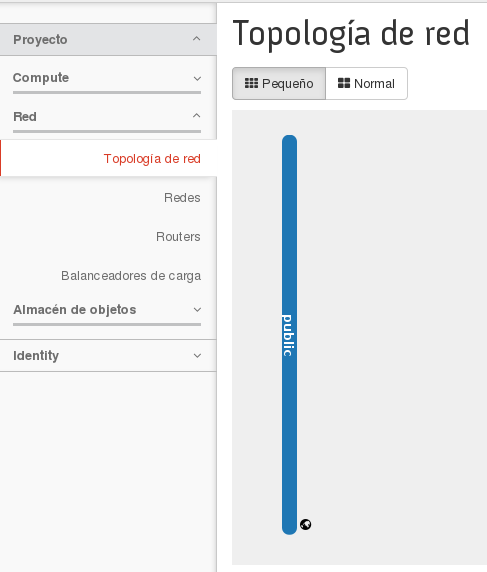

El esquema de red que debe tener nuestro proyecto esta definido por un router conectado a la red externa, y una red interna donde se conectan las instancias. Para ello seguimos los siguientes pasos:

* Creamos un router: Para ello elegimos: **Red**->**Routers**->**Crear router**, escogemos la red externa a la que va a estra conectado nuestro router:

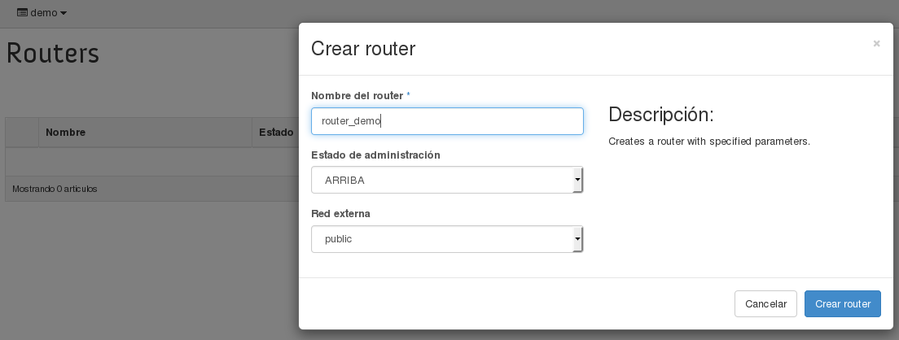

* Creamos una nueva red, con una subred asociada, para ello elegimos **Red**->**Redes**->**Crear red**:

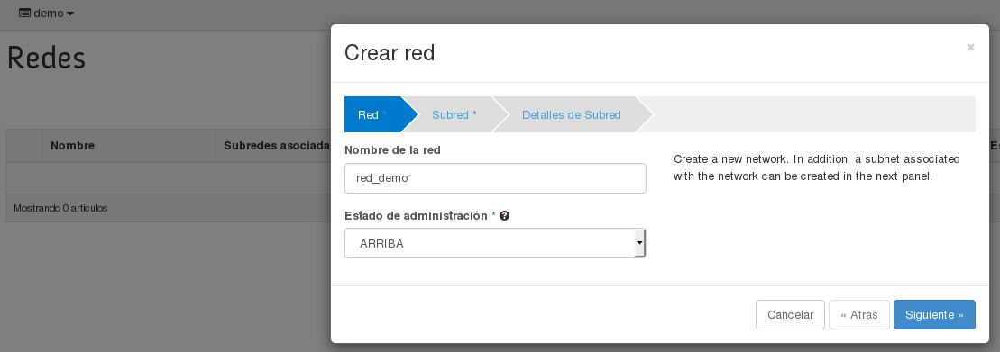

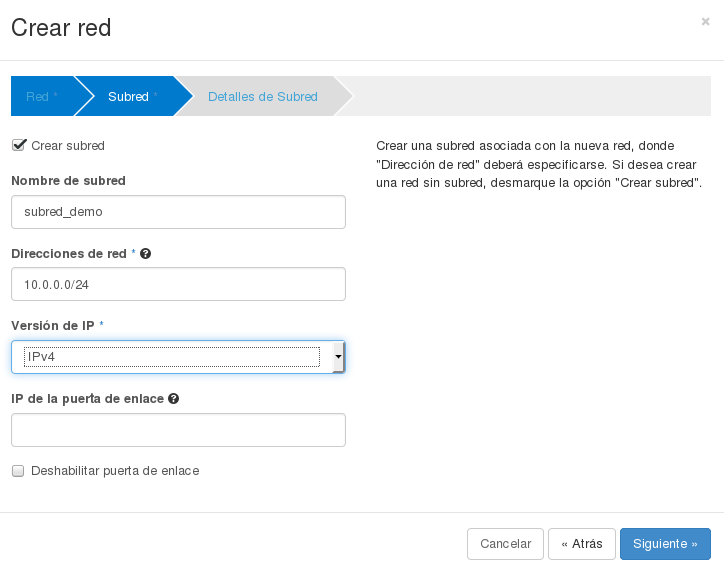

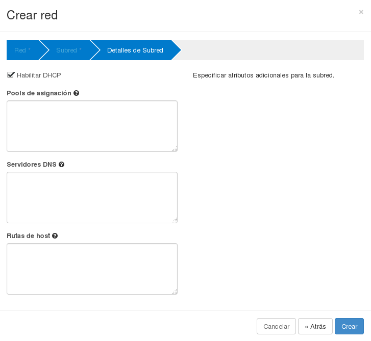

* Por último vamos a conectar el router con la red interna. Para ello seleccionamos nuestro router y elegimos la opción **Interfaces**->**Añadir interfaz**:

y nos queda la siguiente lista de interfaces en nuestro router:

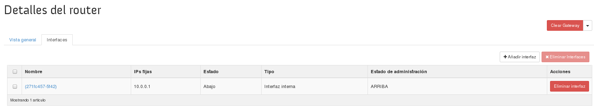

Si volvemos a acceder a la opción **Topología de Red**:

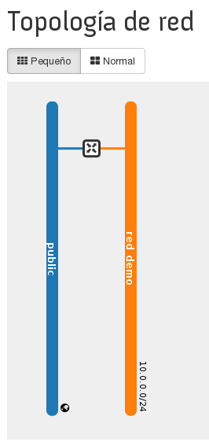

## IPs flotantes 	

Cuando se crea una instancia se le asigna por DHCP una dirección IP que es la
misma durante toda la vida de la instancia, por lo que paradójicamente recibe el
nombre de IP fija. Esta dirección IP permite que la instancia pueda conectarse a
otros equipos de su propia red o incluso de otras redes internas del cloud, pero
si queremos acceder a la instancia desde el exterior es necesario asociar a la
instancia lo que se denomina una IP flotante. Esta IP flotante permite mediante el mecanismo de **Destination
NAT o DNAT** acceder desde Internet a la instancia ubicada en una red interna del
cloud.

### Reservar una IP flotante

Elegimos la opción **IP flotantes** en el apartado **Acceso y Seguridad**
y asignamos una nueva IP que podremos observar que está en el rango de
direcciones IPv4 de nuestra red local. Posteriormente las IP flotantes que hemos reservado se le pueden asociar a las instancias para acceder a ellas.
