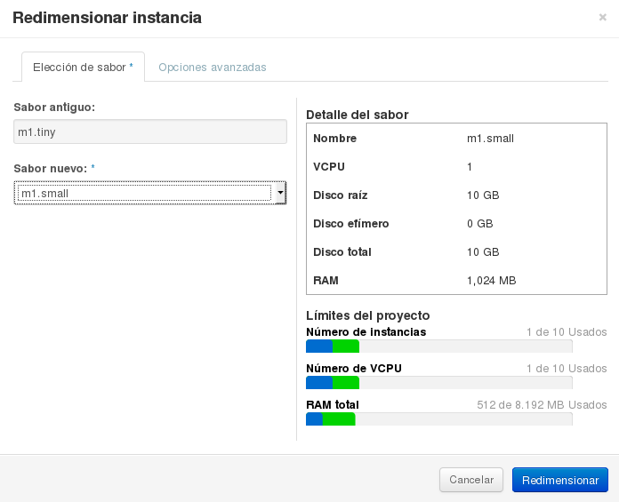
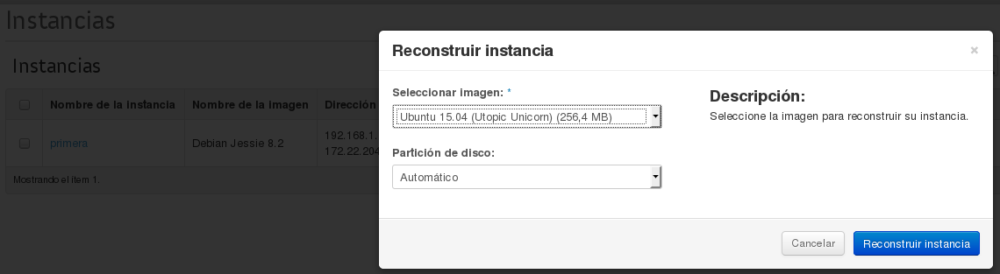

###Redimensión de instancias

Esta acción sirve para cambiar las características hardware del
servidor, modificando el tipo de instancia (sabor) asociado
al mismo. Este proceso también se conoce como escalado vertical o
*scale up*.

Para Realizar estas operaciones el usuario deberá seleccionar la instancia y elegir la opción de **Redimensionar instancia**.

Este proceso se realiza en dos pasos, ya que en un primer paso se
verifica que es posible realizarlo y si se concluye satisfactoriamente
el servidor pasa al estado VERIFY_RESIZE tras el que se le ofrecen al
usuario dos opciones: **Confirmar la redimensión** o **Revertir la
redimensión**.

###Reconstrucción de instancia

La reconstrucción de una instancia es un mecanismo que nos permite rehacer una instancia con otra imagen sin perder la ip fija y otros metadatos.

