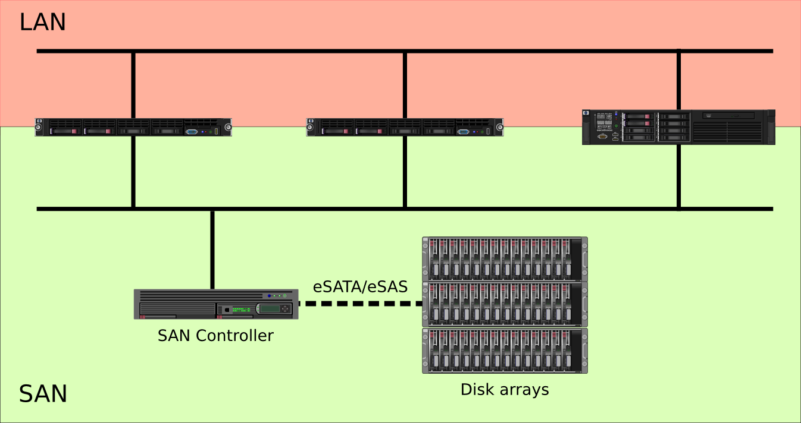

#Conceptos previos de volúmenes

## Redes de almacenamiento

### Storage Area Network (SAN)

* Red dedicada de almacenamiento que proporciona dispositivos de bloques a los servidores
* Los elementos típicos de una SAN son:
	* Red dedicada alta velocidad (cobre o fibra óptica)
    * Equipos o servidores que proporcionan el almacenamiento
    * Servidores que utilizan los dispositivos de bloques
* Los protocolos más utilizados son [iSCSI](http://en.wikipedia.org/wiki/ISCSI) y [Fibre Channel (FC)](http://en.wikipedia.org/wiki/Fiber_channel)

### SAN en OpenStack

* Cinder (OpenStack block storage) gestiona de forma sencilla una SAN
* Puede utilizar una red específica para almacenamiento o alguna de las redes internas del cloud (gestión, datos, etc.)
* Soporta gran cantidad de tecnologías libres de almacenamiento: GlusterFS, LVM, ZFS o Ceph RBD
* Además incluye gran cantidad de [controladores](https://wiki.openstack.org/wiki/CinderSupportMatrix) para equipos específicos

### Terminología

#### Volumen

* Dispositivo de bloques que se puede asociar y desasociar de una instancia cuando se desee.
* Utilizado para proporcionar almacenamiento permanente o independiente de la vida de una instancia.
* El componente de OpenStack que gestiona los volúmenes se llama **Cinder**.
* Un volumen en cinder es equivalente a una unidad lógica en SAN
* Cinder es equivalente a [Amazon EBS](http://aws.amazon.com/es/ebs/).
* Hasta ahora no es posible asociar un volumen a más de una instancia a la vez o modificar el tamaño de un volumen "en caliente".

