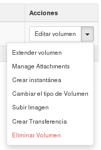
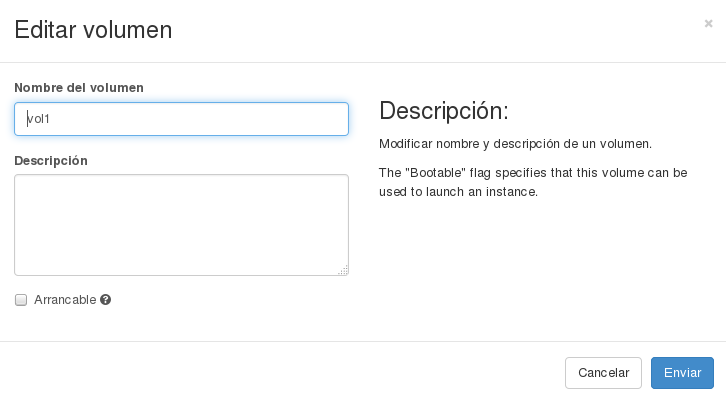
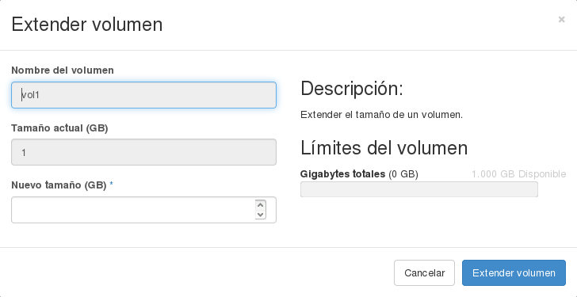

###Operaciones sobre volúmenes

####Editar el volumen

Esta opción nos permite cambiar el nombre y la descripción del volumen. Además, si contiene el contenido de una imagen podemos indicar que el disco va  a ser arrancable.

####Extender volumen

Podemos redimensionar el dispositivo de bloque (el volumen). Esta operación sólo se puede realizar si el volumen esta desasociado de una instancia.
Veamos un ejemplo:

1. Hemos creado un volumen de 1Gb de tamaño lo hemos asociado a una instancia y lo vamos a formatear:

	$ sudo mkfs.ext4 /dev/vdb
	$ sudo mount /dev/vdb /mnt

Y comprobamos el tamaño de nuestro dispositivo de bloque:

	$ df -h
	...
	/dev/vdb               1007.9M     33.3M    923.4M   3% /mnt

2. Vamos a desasociar el volumen y lo vamos a redimensionar a un tamaño de 2Gb:

Lo volvemos a asociar a la instancia, y a continuación tenemos que redimensionar el sistema de ficheros:

	$ sudo e2fsck -f /dev/vdb
	$ sudo resize2fs /dev/vdb
	$ sudo mount /dev/vdb /mnt

Y volvemos a comprobar el tamaño del disco:

	$ df -h
	...
	/dev/vdb                  2.0G     67.0M      1.8G   4% /mnt

####Crear instantánea

####Cambiar el tipo de volumen

####Subir Imagen

####Crear transferencia

####Eliminar volumen