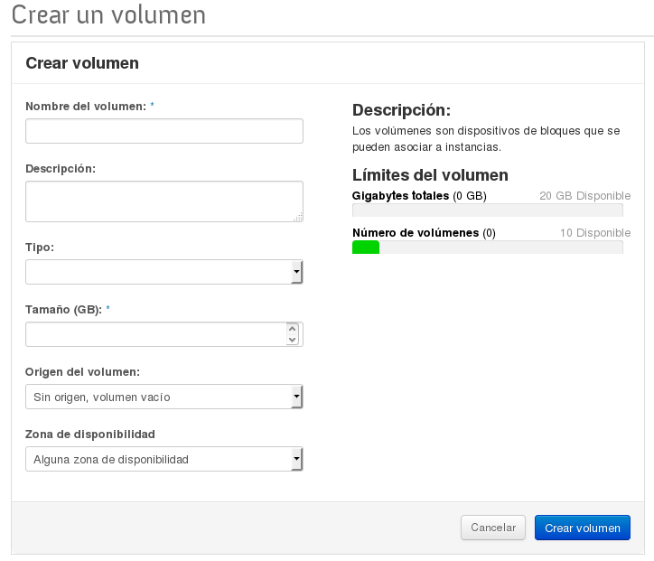
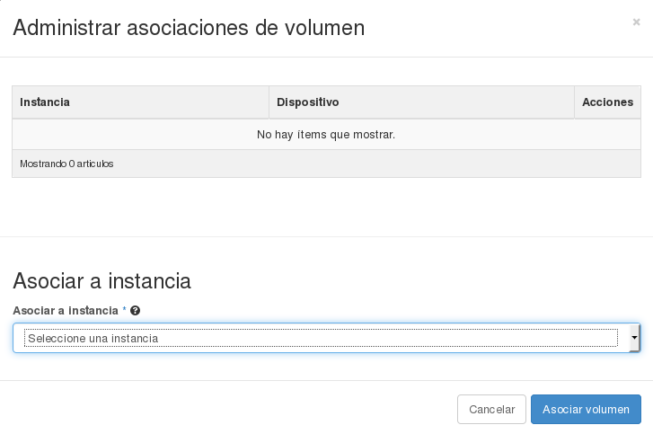
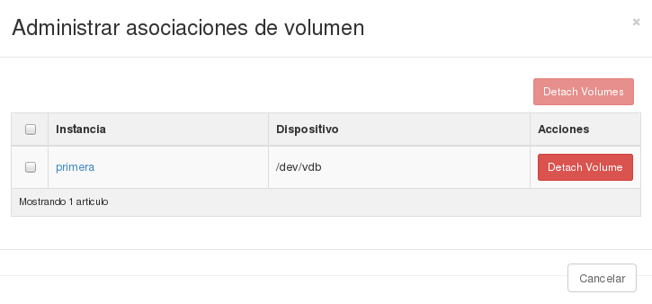

##Creación de volúmenes, asociación a instancias.

### Creación de volúmenes

Podemos definir un volumen como un dispositivo de bloques que se puede asociar y
desasociar a una instancia cuando se desee. Se puede usar para proporcionar
almacenamiento permanente o independiente de la vida de una instancia.

Los pasos para crear un nuevo volumen son los siguientes:

Accedemos al apartado **Volúmenes** y a la opción **Crear Volumen**:

A continuación hay que  introducir la siguiente información:

* Nombre del Volumen: Proporcionamos el nombre que queremos asignar a
* nuestro volumen.
* Tamaño: Indicamos el tamaño en gigabytes que tendrá el nuevo disco.
* Tipo: De la lista desplegable indicamos de qué tipo será el volumen a
crear. Esta opción depende de que haya más de un tipo definido en el cloud que
estemos utilizando o no.
* Imagen: Parámetro opcional. Este campo se indica si se quiere crear un disco
de arranque que contenga la imagen indicada y que puede utilizarse
como disco raíz para una instancia posteriormente.
* Zona: Zona de la nube donde se desea crear. Sólo existen varias
zonas cuando se trata de nubes de infraestructura grandes, en el
caso de este curso la única zona disponible se llama *nova*.
* Descripción: Parámetro opcional. Una breve descripción acerca del disco.

El volumen sólo se podrá eliminar cuando no esté asociado a ninguna instancia.

#### Manage Attachment: Asociar un volumen a una instancia

Esta función nos permite gestionar la asociación entre volúmenes e instancias. Si el volumen no está asociado a ninguna instancia podemos escoger la instancia a la que vamos a asociarlo:

Si el volumen ya está asociado a una instancia, podemos desasociarlo con la misma opción:

Si accedemos a la instancia y comprobamos los dispositivos de bloques que tiene conectada, obtendremos lo siguiente:

	$ lsblk
	NAME MAJ:MIN RM   SIZE RO TYPE MOUNTPOINT
	vda  253:0    0     1G  0 disk /
	vdb  253:16   0     1G  0 disk 
