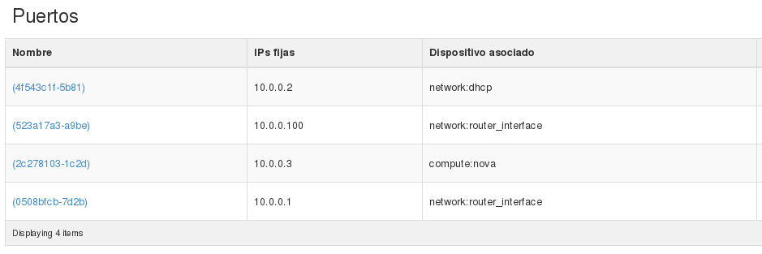

###Ejercicio avanzado de redes con neutron CLI

En esta demostración vamos a crear una nueva red, una nueva subred y un nuevo
router. El router estará conectado a las dos redes internas. El esquema de red
sería el siguiente:

Tenemos que tener en cuenta los siguientes aspectos:

* Al crear el nuevo router, no lo vamos a conectar a la red externa.
* Hay que modificar las características de la subred de la primera red
  para que el servidor dhcp mande una ruta a las instancias
  conectadas a la red para que sean capaces de conectarse a las instancias de la
  segunda red.
* A las instancias que esten conectadas a la segunda red no se le podrán asociar
  ip flotantes, ya que el mecanismo NAT en un router no conectado a la red
  externa no se puede realizar.

#### Creación de la red y el router

En el apartado **Redes** hemos creado una red nueva con un
subred con direccionamiento 20.0.0.0/24 y un nuevo router. Al crear el router
no hemos indicado la **red externa**, por lo que no estará conectada a esa
red. Por último  hemos conectado la nueva red al nuevo router. 

Utilizando *neutron* sería:

    neutron net-create red_demo2
    neutron subnet-create --name subred_demo2 mi_red 20.0.0.0/24
    neutron router-create router_demo2
    neutron router-interface-add router_demo2 subred_demo2

#### Añadir una nueva interfaz al router

Con respecto a la primera subred no basta con añadir el router sin más, ya que en
general las subredes están configuradas para tener un router como puerta de
enlace y le reservan la primera dirección IP de su rango, pero en este caso
habrá dos redes, por lo que tenemos que añadir una nueva interfaz al primer router para conectarlo a la segunda red indicando de forma manuel la dirección que va tener, ya que la primera del rango se ha asignado al primer router.

De forma equivalente, utilizando *neutron* tendríamos que crear un puerto en la primera subred con una ip fija, y posteriormente conectar el router a ese puerto:

    $ neutron port-create red_demo --fixed-ip ip_address=10.0.0.100
    Created a new port:
    +-----------------------+--------------------------------------------------------------------------------------------------------+
    | Field                 | Value                                                                                                  |
    +-----------------------+--------------------------------------------------------------------------------------------------------+
    | admin_state_up        | True                                                                                                   |
    | allowed_address_pairs |                                                                                                        |
    | binding:vnic_type     | normal                                                                                                 |
    | device_id             |                                                                                                        |
    | device_owner          |                                                                                                        |
    | dns_assignment        | {"hostname": "host-10-0-0-100", "ip_address": "10.0.0.100", "fqdn": "host-10-0-0-100.openstacklocal."} |
    | dns_name              |                                                                                                        |
    | fixed_ips             | {"subnet_id": "540c30b9-f57e-4e97-9b80-744c29bb8025", "ip_address": "10.0.0.100"}                      |
    | id                    | 523a17a3-a9be-45a2-ba78-458e778b9567                                                                   |
    | mac_address           | fa:16:3e:30:52:89                                                                                      |
    | name                  |                                                                                                        |
    | network_id            | e73a3536-06ee-454a-a351-190927f25df9                                                                   |
    | security_groups       | fe0f67ee-f00d-4259-b58f-74694cdd76bc                                                                   |
    | status                | DOWN                                                                                                   |
    | tenant_id             | 837e629242de4056a86a53a95465b43c                                                                       |
    +-----------------------+--------------------------------------------------------------------------------------------------------+

La conexión del nuevo router (router_demo2) al puerto que acabamos de crear se puede hacer de la siguiente forma:

    $ neutron port-list
    +--------------------------------------+------+-------------------+-----------------------------------------------------------------------------------+
    | id                                   | name | mac_address       | fixed_ips                                                                         |
    +--------------------------------------+------+-------------------+-----------------------------------------------------------------------------------+
    | 0508bfcb-7d2b-499f-9295-a7319e4d5357 |      | fa:16:3e:c6:05:8e | {"subnet_id": "540c30b9-f57e-4e97-9b80-744c29bb8025", "ip_address": "10.0.0.1"}   |
    | 1b1c34f4-fbe1-427c-80b2-798d2fd5dfb4 |      | fa:16:3e:3b:33:c0 | {"subnet_id": "b1cf136d-fefc-4937-b111-4ea18aba1e5e", "ip_address": "20.0.0.2"}   |
    | 2c278103-1c2d-4da5-9c60-d49f5dcfb53e |      | fa:16:3e:35:c7:70 | {"subnet_id": "540c30b9-f57e-4e97-9b80-744c29bb8025", "ip_address": "10.0.0.3"}   |
    | 4f543c1f-5b81-4436-89e2-276290230345 |      | fa:16:3e:2a:8e:3f | {"subnet_id": "540c30b9-f57e-4e97-9b80-744c29bb8025", "ip_address": "10.0.0.2"}   |
    | 523a17a3-a9be-45a2-ba78-458e778b9567 |      | fa:16:3e:30:52:89 | {"subnet_id": "540c30b9-f57e-4e97-9b80-744c29bb8025", "ip_address": "10.0.0.100"} |
    | 8262288d-1657-4ffe-b00c-749657d9e466 |      | fa:16:3e:21:77:0b | {"subnet_id": "b1cf136d-fefc-4937-b111-4ea18aba1e5e", "ip_address": "20.0.0.1"}   |
    +--------------------------------------+------+-------------------+-----------------------------------------------------------------------------------+

    $ neutron router-interface-add router_demo2 port=523a17a3-a9be-45a2-ba78-458e778b9567
    Added interface 523a17a3-a9be-45a2-ba78-458e778b9567 to router router_demo2.

En la instrucción anterior hemos utilizado el id del puerto que acabamos de crear.

Si visualizamos la lista de puertos de la dos subredes desde horizon:

* Primera red: red_demo

    

* Segunda red: red_demo2
    
    

Podemos ver:

* Que la red que acabamos de crear tiene un puerto conectado a una interfaz del
* router (20.0.0.1)
* Que la otra red está conectada a dos routers (10.0.0.1, al router original
  del proyecto y a 10.0.0.100 a nuestro nuevo router.)

### Añadir las rutas de encaminamiento

Cómo indicábamos anteriormente, hay que modificar las características de la
subred de la primera red red_demo para que el servidor dhcp mande una ruta a
las instancias conectadas a la red para que sean capaces de conectarse a las
instancias de la segunda red. 

Desde horizon:

Con el cliente *neutron*:

    $ neutron subnet-update subred_demo --host_routes type=dict list=true destination=20.0.0.0/24,nexthop=10.0.0.100
    Updated subnet: subred_demo

### Creación de instancias en las redes

Ya podemos crear las intancias en las dos redes, y podemos comprobar que la
instancia conectada a la primera red tiene una nueva regla de encaminamiento: 

    $ ssh -i clave_demo.pem cirros@192.168.0.3
    $ sudo route -n
    Kernel IP routing table
    Destination     Gateway         Genmask         Flags Metric Ref    Use Iface
    0.0.0.0         10.0.0.1        0.0.0.0         UG    0      0        0 eth0
    10.0.0.0        0.0.0.0         255.255.255.0   U     0      0        0 eth0
    20.0.0.0        10.0.0.100      255.255.255.0   UG    0      0        0 eth0

Por lo tanto podemos comprobar la conectividad entre las dos instancias:

    $ ping 20.0.0.101
    PING 20.0.0.101 (20.0.0.101): 56 data bytes
    64 bytes from 20.0.0.101: seq=0 ttl=63 time=2.738 ms
    64 bytes from 20.0.0.101: seq=1 ttl=63 time=2.358 ms

### Asignación de IP flotante a la segunda instancia

¿Qué sucede si intentamos asignar una ip flotante a la segunda instancia? La
segunda instancia no está conectada directamente a la red externa por un router,
por lo tanto no se pueden crear las reglas NAT necesarias en la asignación de la
IP flotante, y por tanto está operación nos devuelve un error: 

    $ openstack ip floating add 192.168.0.5 instancia2
    Unable to associate floating ip 192.168.0.5 to fixed ip 20.0.0.101 for instance d36a0df4-7a17-4476-abed-71566ea8b118. Error: External network 24e364df-1c1f-4c90-b254-7465578afbdd is not reachable from subnet b1cf136d-fefc-4937-b111-4ea18aba1e5e.  Therefore, cannot associate Port 4db27e0a-51e0-4f4b-953e-46fc4f972cf1 with a Floating IP. (HTTP 400) (Request-ID: req-fc72efc6-a575-49b5-b56f-b30f261c2443)

Desde horizon podemos comprobar que no nos permite asociar una IP flotante a esta instancia, en la lista de **Puerto a asociar** no podemos escoger la segunda instancia:

### Accediendo a la segunda instancia

La única forma de acceder a la segunda instancia es desde la primera, pero para
ello necesitamos nuestra clave privada en la primera instancia, por lo tanto
vamos a copiar nuestro fichero pem a la primera instancia: 

    scp -i clave_demo.pem calve_demo.pem cirros@192.168.0.3:/home/cirros

y a continuación accedemos a la primera instancia y usaremos el la clave privada
para acceder a la segunda:

    $ chmod 400 mi_clave.pem 
    $ ssh -i mi_clave.pem debian@20.0.0.101

y por último comprobamos que desde la segunda instancia tenemos conectividad con
la primera:

    $ ping 10.0.0.3
    PING 10.0.0.3 (10.0.0.3): 56 data bytes
    64 bytes from 10.0.0.3: seq=0 ttl=63 time=0.936 ms
    64 bytes from 10.0.0.3: seq=1 ttl=63 time=0.751 ms

### Añadir reglas de encaminamiento al primer router

Si probamos a hacer ping desde la seunda instancia al primer router, veremos que no tenemos conectividad. La instrucción para añadir una regla de encaminamiento al primer
router para que pueda acceder a la nueva red interna es: 

    neutron router-update router_demo --routes type=dict list=true destination=20.0.0.0/24,nexthop=10.0.0.100

### Borrar las reglas de encaminamiento

Para poder eliminar los elementos de red que hemos creado hay que
borrar manualmente antes las reglas de encaminamiento estático que se
han definido, que se hace con las instrucciones:

    neutron router-update router_demo --routes action=clear
    neutron subnet-update subred_demo --host_routes action=clear

