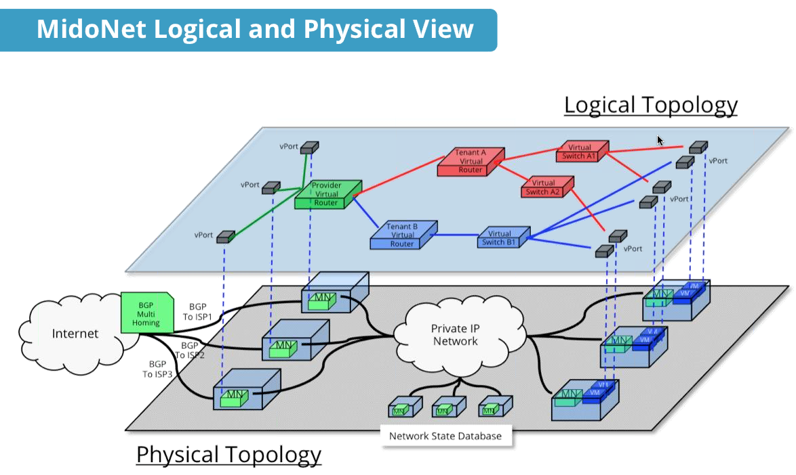

#### Introducción a la virtualización de redes

### Redes virtuales

Una persona que lleve varios años utilizando tecnologías de
virtualización tendrá bastante claro lo que es una red virtual, ya que
independientemente de la tecnología de virtualización que utilice
estará acostumbrada a crear pequeñas y sencillas redes virtuales
dentro del equipo que aloja las máquinas virtuales, para que estas
puedan estar conectadas o aisladas entre sí o para que tengan conexión
con el exterior por ejemplo.

Las redes virtuales de este tipo se definen dentro del equipo que
actúa como hipervisor y se comunican con el exterior a través de las
interfaces de red físicas de este equipo, utilizando el resto de
elementos físicos o lógicos de la red donde se ubique el hipervisor:
switches, routers, redes físicas, vlans, cortafuegos, etc. En cada
hipervisor hay definida una o varias redes virtuales y éstas son
gestionadas de forma independiente unas de otras.

### Virtualización de redes, redes definidas por software y virtualización de las funciones de red.

El campo de las redes está últimamente revolucionado y se escuchan por
todos sitios tres términos o sus equivalentes siglas en inglés:
virtualización de redes o *network virtualization* (NV), redes
definidas por software o *software defined networks* (SDN) y
virtualización de las funciones de red o *network function
virtualization* (NFV). Las empresas de virtualización, hardware, redes
o telecomunicaciones se han lanzado hacia estas tecnologías y ofrecen
soluciones en uno o varios de estos campos, ya que no están claramente
definidos los límites de cada uno o porque solapan unos con otros en
muchos casos.

A nuestro modesto entender, ahora mismo lo más importante no es
definir claramente cada una de estas tecnologías ya que nos parece que
las diferencias pueden estar más relacionadas con aspectos comerciales
o de marketing que con diferencias importantes entre una y otra, pero
sí destacar las diferencias que ofrecen este conjunto de tecnologías
respecto a las redes clásicas o las redes virtuales definidas como
hasta ahora. Algunas de estas diferencias son:

* Todos los elementos de la red pasan a controlarse de forma
  centralizada
* Los elementos de la red pueden entenderse unos con otros
  independientemente del fabricante
* Se crea una sola red a nivel lógico que se divide en las redes
  necesarias
* La misma red virtual puede estar definida en varios hipervisores y
  controlarse de forma centralizada
* Las funciones de red como cortafuegos, balanceadores, QoS, etc. se
  pueden definir por software, ubicar en cualquier punto de la red y
  controlar centralizadamente.

En la siguiente imagen podemos ver una representación del
desacoplamiento entre la topología física y la lógica a nivel de toda
la red de una organización:

Todo esto es bastante revolucionario y choca en muchos casos con los
intereses de  las empresas que han dominado determinados sectores, así
tenemos por ejemplo que la empresa VMware, especializada en vender
software para hipervisores adquirió la empresa Nicira, especializada
en SDN y pasó a competir en este sector con gigantes como Cisco o
Juniper.

En el caso de OpenStack ya podemos disfrutar de varias características
de estas tecnologías puesto que OpenStack neutron las proporciona y
las hemos estado utilizando durante todo el curso sin apenas darnos
cuenta. También es importante entender que, a diferencia de lo que
ocurría con las instancias y los volúmenes que se sustentan en
tecnologías más maduras y estables, la virtualización de redes está
evolucionando de forma paralela al cloud computing y la implementación
de algunas funcionalidades no es siempre lo madura que quisiéramos.