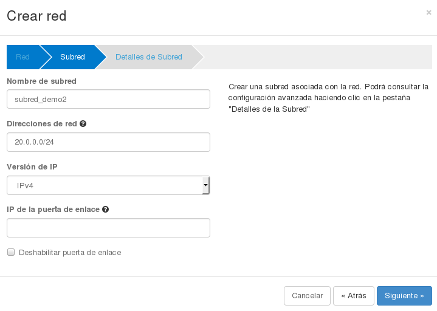

###Gestión de redes con horizon

Partimos del siguiente esquema de red con el que hemos estado trabajando:

En esta demostración vamos a crear una nueva red, una nueva subred y un nuevo router. El router estará conectado a la red externa y a la nueva red creada. El esquema de red sería el siguiente:

1. En el apartado **Redes** vamos a crear una nueva red.

	

	Los datos que vamos a introducir son los siguientes:

	* **Nombre de la red**
	* **Estado de administración**: Podemos indicar si la red va a esta habilitada (up/arriba) o deshabilitada (down/abajo).
	* **Crear subred**: Indicamos si vamos a crear una subred asociada.

	A continuación indicamos los datos de la subred asociada:

	

	* **Nombre de subred**: El usuario deberá indicar un nombre a proporcionarle a la subred.
	* **Direcciones de red**: Se debe introducir un CIDR válido, el cual indicará un bloque de direcciones IPs.
	* **Versión IP**: Se especifica la versión de las direcciones IPs.
	* **IP de la puerta de enlace**: Dirección IP que especificamos para la puerta de enlace. Debe pertenecer a las direcciones del CIDR. Si se especifica este valor tenemos que comprobar que esta dirección no se superpone a alguna dirección del pool de direcciones. Si no se indica, se cogera la primera dirección del pool de direcciones.
	* **Deshabilitar la puerta de enlace**: Si escogemos esta opción no se enviará gateway a las instancias que se conecten a esta red.

		

	* **Habilitar DHCP**: Con esta opción activamos o desactivamos el servidor DHCP asociado a esta red.
	* **Pool de direcciones**: Indica el rango de direcciones IPs que se utilizarán para asignar IPs a los servidores virtuales. Este rango debe pertenecer a las direcciones del CIDR. 	
	* **Servidores DNS**: El usuario puede especificar una lista de dns. Este campo se introduce separado por comas.
	* Rutas de hosts**: Son las rutas de encaminamiento que el servidor DHCP va a enviar a las instancias que se conecten a la red.
	

