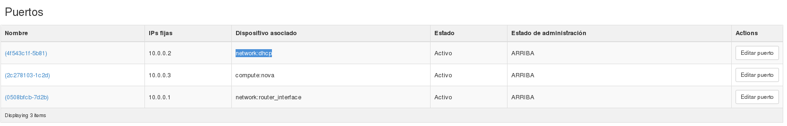

###Puertos de red

Un puerto de red (realmente los puertos están asociados a la subred que hemos definido en la red) lo podmos entender como un puerto virtual de un "switch virtual" que interconecta todos los dispositivos conectados a la red. Para acceder a los puertos de una subred, escogemos la red a la que correpsonde y vemos la siguiente pantalla:

Como podemos observar tenemos tres puertos:

* **network:router_interface**: Este puerto corresponde con la interfaz de red conectada al router, y como vimos anteriormente ha tomado la primera dirección del pool de direcciones configurada en el servidor DHCP.
* **compute:nova**: Correponde al puerto donde se ha conectado la instancia que hemos conectado a la red.
* **network:dhcp**: Correponde con el puerto donde tenemos conectado el servidor DHCP de la red. Este servidor se crea cuando arrancamos la primera instancia que conectamos a lared, y como puedes observar coge una dirección ip anterior a la que escoge la instancia.
