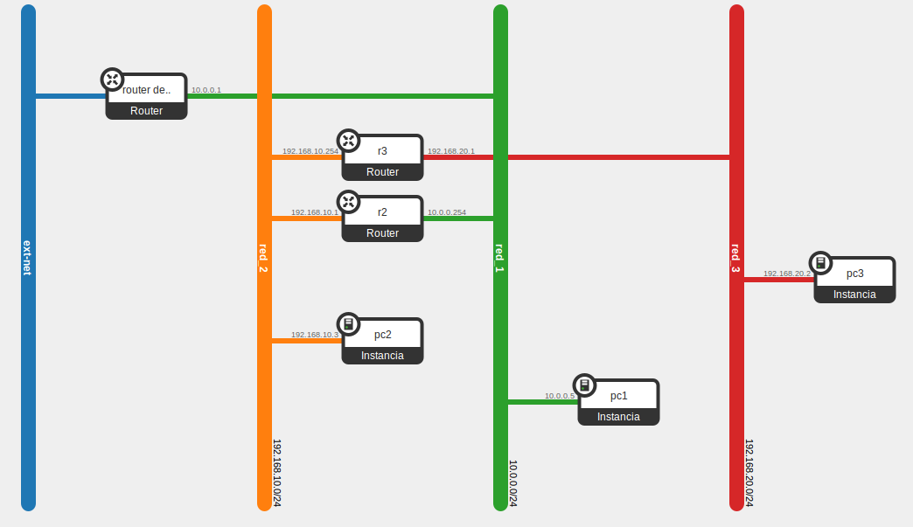

##Creación automática de un escenario

## Shell script

Utilizando las instrucciones *nova* y *neutron* se puede escribir un shell
script para configurar automáticamente la infraestructura de OpenStack, esto
permite además incluir en este tipo de scripts cualquier otra aplicación o
funcionalidad que podamos utilizar desde la línea de comandos, aumentando
enormemente las posibilidades. 

### Ejemplo

Vamos a crear un escenario sencillo en el que vamos a crear el siguiente
escenario:

Para ello utilizaremos el script <a href="demo.sh">demo.sh</a>

Una vez ejecutado el script tendremos el escenario completamente configurado y
operativo y podremos acceder a la instancia que tiene asociada una IP flotante y
desde ella a las demás (en este caso simplemente lo verificamos haciendo ping
para no tener que copiar la clave privada como se hizo anteriormente).

También hemos preparado un script que elimina correctamente todos los elementos
del escenario anterior y que tenéis a vuestra disposición en <a
href="demo-inv.sh">demo-inv.sh</a>.

## Gestión de la infraestructua desde Python

La utilización de un shell script es muy adecuado para procesos muy repetitivos
o cuando sea conveniente incluir entre los comandos de OpenStack otros comandos
del sistema, pero lógicamente desde el punto de vista de programación un shell
script siempre deja mucho que desear respecto a un lenguaje más
completo. OpenStack ofrece SDKs con bibliotecas oficiales completas o parciales
para la mayoría de los lenguajes de programación, con especial énfasis en Python
ya que OpenStack se desarrolla completamente en este lenguaje y por tanto las
bibliotecas de Python son las "nativas".

Aunque obviamente explicar este tema excede los objetivos de este curso, dejamos
como referencia dos enlaces que pueden interesar a quien decida profundizar en
este campo. El primero de ellos es más sencillo y explica la forma de lanzar una
instancia utilizando un intérprete de python, mientras que el segundo es un
programa que se realizó para el alta masiva de usuarios del cloud del IES
Gonzalo Nazareno, extrayendo los datos del LDAP del centro y creando para cada
usuario un proyecto completamente funcional.

<ul>
<li><a
href="https://albertomolina.wordpress.com/2013/11/20/how-to-launch-an-instance-on-openstack-iii-python-novaclient-library/">How
to launch an instance on OpenStack (III): Python novaclient library</a></li>
<li><a
href="https://github.com/iesgn/iesgncloud/blob/master/adduser-cloud.py">adduser-cloud.py</a>
</ul>